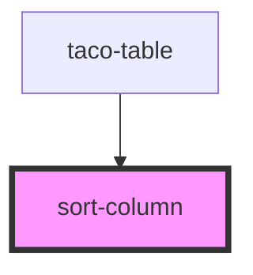

# sort-column

<!-- Auto Generated Below -->

## Properties

| Property     | Attribute     | Description | Type     | Default     |
| ------------ | ------------- | ----------- | -------- | ----------- |
| `columnName` | `column-name` |             | `string` | `undefined` |

## Dependencies

### Used by

 - [taco-table](../taco-table)

### Graph

----------------------------------------------

*Built with [StencilJS](https://stenciljs.com/)*
