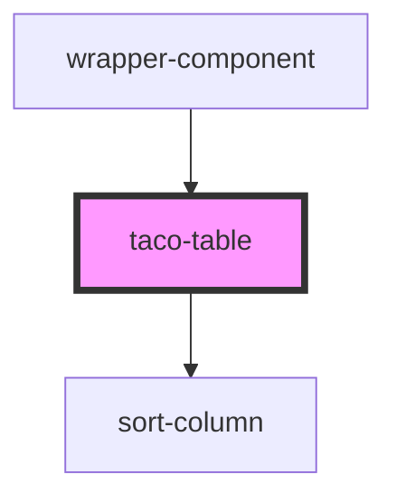

# taco-table

<!-- Auto Generated Below -->

## Properties

| Property  | Attribute | Description | Type                                                                              | Default                                                                              |
| --------- | --------- | ----------- | --------------------------------------------------------------------------------- | ------------------------------------------------------------------------------------ |
| `columns` | --        |             | `{ title: string; id: string; hasSorting: BooleanConstructor; class: string; }[]` | `[{       title:'',       id: '',       hasSorting: Boolean,       class: ""     }]` |
| `rows`    | --        |             | `[any]`                                                                           | `undefined`                                                                          |

## Events

| Event  | Description | Type               |
| ------ | ----------- | ------------------ |
| `sort` |             | `CustomEvent<any>` |

## Dependencies

### Used by

 - [wrapper-component](../wrapper-component)

### Depends on

- [sort-column](../sort-column)

### Graph

----------------------------------------------

*Built with [StencilJS](https://stenciljs.com/)*
